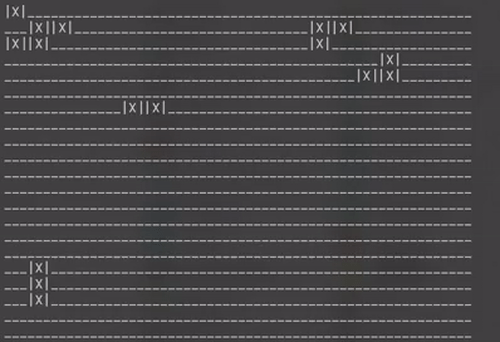

# Universidad Católica del Uruguay

## Facultad de Ingeniería y Tecnologías

### Programación II

# Conway's Game of Life

## Contexto

[John Conway](https://en.wikipedia.org/wiki/John_Horton_Conway) fue un
matemático inglés muy conocido por sus aportes matemáticos en diversas áreas,
pero lo que realmente lo hizo famoso fue su creación lúdica: [juego de la
vida](https://en.wikipedia.org/wiki/Conway%27s_Game_of_Life).


El juego de la vida consiste en un autómata celular con unas pocas reglas muy
simples. El universo es una grilla ortogonal de dos dimensiones, donde cada
espacio de la grilla representa una única célula. Cada célula puede estar viva o
muerta. Cada una de estas células tendra 8 vecinos. En cada iteración del tiempo
(generación) una célula estará viva o muerta según la cantidad de vecinos vivos
o muertos que tenga. Siguiendo estas reglas:

* Una célula viva con menos de 2 vecinos vivos muere, por soledad.
* Una célula viva con 2 o 3 vecinos vivos sobrevive a la siguiente generación.
* Una célula viva con más de 3 vecinos vivos muere, por sobrepoblación.
* Una célula muerta con exactamente 3 vecinos vivos se convierte en una célula
  viva, por reproducción

## Objetivo

Como tributo a Conway ¡hoy vamos a crear este juego en consola! Para ello te
vamos a proveer de varios code
[snippets](https://en.wikipedia.org/wiki/Snippet_(programming)) y será tu
trabajo asignarlos a la clase correcta cumpliendo con Expert y SRP.

Tómate tu tiempo para entender que hace cada *code snippet*. Cada uno de ellos
implementa una responsabilidad, tu desafío es definir qué clase es la que debe
tener esa responsabilidad, usando las guías Expert y SRP para ello.

El objetivo será desarrollar este juego mediante objetos diferentes, cada uno
con una sola razón de cambio. El tablero deberá ser cargado a partir de un
archivo de texto —como [este](/assets/board.txt)— y luego el avance del juego
deberá ser impreso en pantalla mediante consola.

> [!TIP]
> Debes tener en cuenta que hoy se pide que el juego se lea desde un archivo y
> se imprima en consola, pero mañana podremos pedirles que se lea de una fuente
> diferente y se muestre en pantalla por otro medio :wink:

<br>

> [!IMPORTANT]
> Recuerda agregar comentarios a todas tus clases justificando tus decisiones de
> diseño, es decir, por qué crees que si cumplen o no con SRP y Expert.

Si todo ha funcionado correctamente, tu resultado debería verse algo similar a esto:



## Code Snippets
A continuación se presentan fragmentos de código suelto (snippets) que podrás reutilizar en tu solución.

> [!WARNING]
> Estos fragmentos de código son genéricos y no funcionaran simplemente haciendo
> copy/paste. Si bien la estructura general y la mayoría del código no debería
> ser necesario modificarlo, deberan ser adaptados a tu solución propuesta.

### Lógica de juego
El siguiente code snippet contiene la lógica necesaria para procesar una
generación del juego.

Se asume:

* Que el tablero es un vector —*array*— de 2 dimensiones de booleanos, donde
  ```true``` indica una célula viva y ```false``` indica una célula muerta. Este
  vector de dos dimensiones es en realidad una matriz, donde una dimensión son
  las filas, y la otra dimensión son las columnas.
* El objeto ```gameBoard``` contiene uun vector —*array*— ya cargado con todos
  los valores asignados.

```csharp
bool[,] gameBoard = /* contenido del tablero */;
int boardWidth = gameBoard.GetLength(0);
int boardHeight = gameBoard.GetLength(1);

bool[,] cloneboard = new bool[boardWidth, boardHeight];
for (int x = 0; x < boardWidth; x++)
{
    for (int y = 0; y < boardHeight; y++)
    {
        int aliveNeighbors = 0;
        for (int i = x-1; i<=x+1;i++)
        {
            for (int j = y-1;j<=y+1;j++)
            {
                if(i>=0 && i<boardWidth && j>=0 && j < boardHeight && gameBoard[i,j])
                {
                    aliveNeighbors++;
                }
            }
        }
        if(gameBoard[x,y])
        {
            aliveNeighbors--;
        }
        if (gameBoard[x,y] && aliveNeighbors < 2)
        {
            //Celula muere por baja población
            cloneboard[x,y] = false;
        }
        else if (gameBoard[x,y] && aliveNeighbors > 3)
        {
            //Celula muere por sobrepoblación
            cloneboard[x,y] = false;
        }
        else if (!gameBoard[x,y] && aliveNeighbors == 3)
        {
            //Celula nace por reproducción
            cloneboard[x,y] = true;
        }
        else
        {
            //Celula mantiene el estado que tenía
            cloneboard[x,y] = gameBoard[x,y];
        }
    }
}
gameBoard = cloneboard;
```

> ```bool[,]``` es la declaración de un vector -array- multidimensional. Puedes
> ver
> [aquí](https://docs.microsoft.com/en-us/dotnet/csharp/programming-guide/arrays/multidimensional-arrays)
> más información.

### Leer Archivo

Este snippet muestra como leer un archivo y crear una matriz de booleanos
(```bool[,]```) con el contenido —un vector o *array* bi-dimensional—. Se asume
que cada linea del archivo corresponde a una fila de la matriz y cada caracter
de la fila corresponde a un elemento de la fila correspondiente de la matriz.
Tambien se asume que el archivo contiene solamente los caracteres ```1``` y
```0``` correspondientes a ```true``` y ```false``` respectivamente y que todas
las filas son de igual largo.

Por ejemplo, el siguiente archivo de texto:

```none
100
011
110
```

se convierte en la siguiente matriz:

```csharp
bool[3,3] {
    {true, false, false},
    {false, true, true},
    {true, true, false}
};
```

> Esta forma incluso tiene nombre y se llama glider
>
> 

Snippet de código:

```csharp
string url = "ruta del archivo";
string content = File.ReadAllText(url);
string[] contentLines = content.Split('\n');
bool[,] board = new bool[contentLines.Length, contentLines[0].Length];
for (int  y=0; y<contentLines.Length;y++)
{
    for (int x=0; x<contentLines[y].Length; x++)
    {
        if(contentLines[y][x]=='1')
        {
            board[x,y]=true;
        }
    }
}
```

> La clase ```File``` está definida en el espacio de nombres ```Sytem.IO```.
> Debes incluirlo utilizando una cláusula ```using```.

<br>

> [!TIP]
> Este proyecto está configurado para copiar el archivo `board.txt` al
> directorio desde donde se ejecutará tu programa cuando lo depures o lo
> ejecutes desde Rider. Por eso no es necesario indicar la ruta cuando quieras
> abrir el archivo, usa solamente el nombre.

### Imprimir Tablero

Aqui se muestra como imprimir un tablero por consola. Observa que este código
requiere invocar el snippet de la lógica de juego

```csharp
bool[,] b //variable que representa el tablero
int width //variabe que representa el ancho del tablero
int height //variabe que representa altura del tablero
while (true)
{
    Console.Clear();
    StringBuilder s = new StringBuilder();
    for (int y = 0; y<height;y++)
    {
        for (int x = 0; x<width; x++)
        {
            if(b[x,y])
            {
                s.Append("|X|");
            }
            else
            {
                s.Append("___");
            }
        }
        s.Append("\n");
    }
    Console.WriteLine(s.ToString());
    //=================================================
    //Invocar método para calcular siguiente generación
    //=================================================
    Thread.Sleep(300);
}
```

> La clase ```StringBuilder``` está definida en el espacio de nombres
> ```Sytem.Text```. Debes incluirlo utilizando una cláusula ```using```.

## Rúbrica corrección

La corrección de este ejercicio la harán los profesores usando la siguiente rúbrica:

<table>
  <tr>
    <th width="20%">Ítem a evaluar</th>
    <th width="20%">Perfecto</th>
    <th width="20%">Correcto</th>
    <th width="20%">Mejorable</th>
    <th width="20%">Mal</th>
  </tr>
  <tr>
    <td>
      Código entregado
    </td>
    <td colspan="3">
      El código compila
    </td>
    <td>
      No hay una entrega, o el código entregado no compila
    </td>
  </tr>
  <tr>
    <td>
      Distribución de responsabilidades
    </td>
    <td>Las clases y sus responsabilidades son correctas</td>
    <td>Casi todas las clases y responsabilidades son correctas</td>
    <td>Las responsabilidades no están bien distribuidas</td>
    <td>No hay un intento de distribuir responsabilidades</td>
  </tr>
  <tr>
    <td>
      Comentarios
    </td>
    <td>Justifica correctamente la distribución de responsabilidades</td>
    <td>Casi todas las justificaciones son correctas</td>
    <td>Faltan justificaciones o no son claras</td>
    <td>No hay justificaciones o no son correctas</td>
  </tr>
  <tr>
    <td>Convenciones en C#</td>
    <td>Sigue las convenciones de código</td>
    <td colspan="2">Sigue algunas convenciones de código</td>
    <td>No sigue las convenciones de código</td>
  </tr>
</table>
